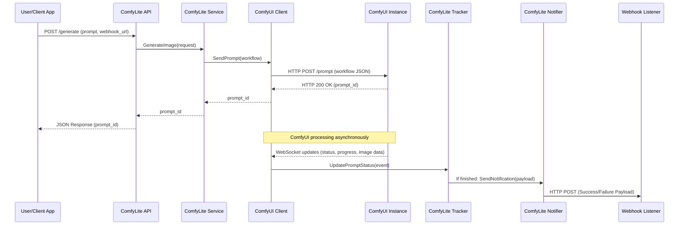

# ComfyLite


## 🚀 Overview

ComfyLite is a lightweight Go application designed to simplify and streamline interaction with a local ComfyUI instance. It originated from the need to easily integrate and manage generative AI capabilities within a web application, see [WonderPicAI](https://github.com/CP-Payne/WonderPicAi), leveraging ComfyUI's powerful and flexible workflow system.

ComfyLite allows users to submit image generation requests with customizable parameters and receive the resulting images asynchronously via webhooks.

Its core purpose is to abstract the complexity of ComfyUI workflows and provide a clean, flexible API that enables rapid development and easy deployment of different models and workflows

Key capabilities include:

**Seamless workflow switching**: Quickly switch between ComfyUI workflows or AI models by simply adding a new template JSON and config file.

**Minimal setup for new workflows**: Define your workflow in ComfyUI, export the JSON, create a simple config mapping in ComfyLite, and optionally update the handler to support additional parameters.

**Webhook-based result delivery**: Receive image generation results (success or failure) directly to your application via webhook, supporting asynchronous system integration.

**Synchronous prompt queueing**: ComfyLite processes image generation statuses in a sequential order as updates are received via a websocket from ComfyUI. Once ComfyLite detects that an image generation prompt has succeeded or failed, it immediately notifies the consumer via a webhook and then proceeds to track or await the next prompt from ComfyUI.

Designed for simplicity and efficiency, ComfyLite makes it easier to integrate dynamic generative AI capabilities into your applications.

## ✨ Features

* **HTTP API Endpoint:** A simple `/generate` endpoint to trigger image generation.
* **Dynamic Workflow Generation:** Builds ComfyUI workflows on the fly using customizable templates and configuration mappings.
* **Asynchronous Processing:** Submits prompts to ComfyUI and tracks their execution without blocking the API response.
* **Webhook Notifications:** Delivers status updates (success/failure) and Base64-encoded generated images directly to your specified webhook URL.
* **Prompt Tracking & Monitoring:** Monitors the progress of image generation tasks and handles timeouts.
* **Configurable Parameters:** Easily map generic request parameters (e.g., `prompt`, `seed`, `width`, `height`, `imageCount`) to specific nodes within your ComfyUI workflows.
* **Environment Variable Support:** Configurable via `.env` files or system environment variables for flexible deployment.

## Sequence Diagram

This sequence diagram shows the interaction between the internal and external components and the chronological flow of messages.



## 🛠️ Getting Started

### Prerequisites

* Go (version 1.20 or later recommended)
* A running [ComfyUI](https://www.comfy.org) instance
* (Optional) Git for cloning the repository

### Installation

1.  **Clone the repository:**
    ```bash
    git clone https://github.com/CP-Payne/ComfyLite.git
    cd ComfyLite
    ```

2.  **Install dependencies:**
    ```bash
    go mod tidy
    ```

### Configuration

ComfyLite can be configured using environment variables or a `.env` file in the root directory of the `ComfyLite-rework` project.

* `COMFYLITE_ADDRESS`: The address on which the ComfyLite server will listen (e.g., `:8083`). Defaults to `:8083`.
* `COMFYUI_ADDRESS`: The base URL of your running ComfyUI instance (e.g., `http://127.0.0.1:8000`). Defaults to `http://127.0.0.1:8000`.

Example `.env` file:
```
COMFYLITE_ADDRESS=:8083
COMFYUI_ADDRESS=http://127.0.0.1:8000
```

### Running the Application

```bash
go run ./cmd/comfylite/main.go
```
The server will start and listen on the configured address.

## 🖥️ Usage
ComfyLite exposes a single API endpoint for image generation.

`POST /generate`

Submits a request to generate an image using.

**Request Body Example:**
```json
{
    "prompt": "A futuristic city at sunset, highly detailed, cyberpunk style",
    "image_count": 1,
    "width": 450,
    "height": 450,
    "webhook_url": "<your webhook listener>"
}
```
**Request Parameters:**
- `prompt` (string, **required**): The text prompt for image generation.
- `image_count` (int, optional): The number of images to generate. Defaults to `1`.
- `width` (int, optional): The desired width of the generated image. Defaults to `450`.
- `height` (int, optional): The desired height of the generated image. Defaults to `450`.
- `webhook_url` (string, optional): An optional URL where ComfyLite will send updates about the generation process (success/failure) and the final images.

**Response Body (Success):**
```json
{
    "prompt_id": "a1b2c3d4-e5f6-7890-1234-567890abcdef"
}
```

The `prompt_id` can be used by the consumer to track image results from the webhook. When a request is sent to the consumer through the webhook, the `pompt_id` will be included again.

**Response Body (Error):**
```json
{
    "error": "prompt cannot be empty"
}
```

**📄 Want to add new workflows?** See the [🧩 Custom Workflow Integration Guide](docs/custom_workflows.md).
### Webhook Payload Example
When `webhook_url` is provided in the `POST /generate` request, ComfyLite will send a POST request to this URL with a JSON payload upon completion or failure of the image generation.

**Success Payload:**
```json
{
    "status": "success",
    "prompt_id": "a1b2c3d4-e5f6-7890-1234-567890abcdef",
    "images": [
        "base64encodedImage1",
        "base64encodedImage2"
    ]
}
```
**Failure Payload:**

```json
{
    "status": "failure",
    "prompt_id": "a1b2c3d4-e5f6-7890-1234-567890abcdef",
    "error": "prompt failed validation: expected 1 images, got 0. finish_signal: false"
}
```


## 📂 Project Structure At A Glance

```
.
├── cmd/
│   └── comfylite/
│       └── main.go           # Main application entry point
├── configs/
│   ├── flux.yaml             # Configuration for the 'flux' workflow
│   └── starter.yaml          # Configuration for the 'starter' workflow
├── internal/
│   ├── api/
│   │   ├── handler.go        # HTTP API handlers
│   │   └── types.go          # API request/response types
│   ├── comfy/
│   │   └── client.go         # ComfyUI client for WebSocket and HTTP communication
│   ├── notifier/
│   │   ├── types.go          # Webhook notifier types
│   │   └── webhook.go        # Webhook notification logic
│   ├── service/
│   │   └── service.go        # Core business logic and orchestration
│   ├── tracker/
│   │   ├── tracker.go        # Prompt tracking and state management
│   │   └── types.go          # Tracker event and state types
│   └── workflow/
│       └── manager.go        # Workflow building and parameter mapping
├── docs/
│   ├── custom_workflows.md   # Documentation for adding custom workflows
├── templates/
│   ├── flux.json             # ComfyUI workflow template for 'flux'
│   └── starter.json          # ComfyUI workflow template for 'starter'
├── .gitignore                # Specifies intentionally untracked files
└── README.md                 # Project documentation
```


## 🛠️ Features I plan to add **later** 
- Dynamic workflow switch without restarting server
    - Allow a client to verify if a specific workflow exist through sending a request
    - Allow a client to specify a workflow to use on each prompt request

## 🤝 Contributing

Contributions are welcome! Please feel free to open issues or submit pull requests.

## 📄 License

This project is licensed under the [MIT License](LICENSE).

